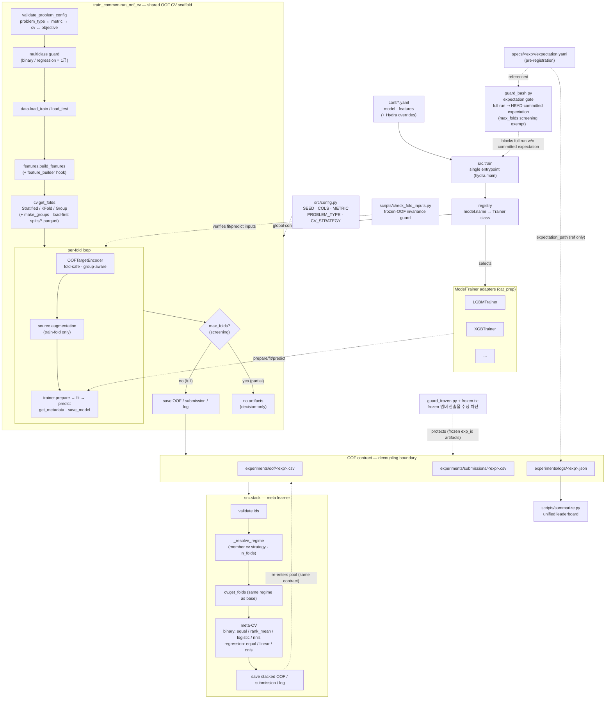

# 아키텍처

이 템플릿의 전체 데이터 흐름과 책임 경계를 한 장으로 나타낸다. 핵심 원리는
**단일 스캐폴드 + 어댑터**(모델 추가 = 어댑터 1개)와 **OOF 계약**(스택 풀의 디커플링
경계)이다. 자세한 규율은 [CLAUDE.md](CLAUDE.md)·[README.ko.md](README.ko.md) 참조.

## 읽는 법

- **실선 화살표** = 데이터/제어 흐름. **점선 화살표** = 참조·검증·선택(흐름 외 의존).
- `train_common.run_oof_cv` 가 공통 골격(검증→로드→피처→CV→fold loop→산출)을 **단일 소스**로
  통제하고, 모델 차이는 `ModelTrainer` 어댑터(`prepare/fit/predict/get_metadata/save_model`)만
  제공한다. 골격을 고치면 모든 모델이 한 번에 따라온다(노브 divergence 차단).
- **OOF 계약**(`experiments/{oof,submissions,logs}/<exp>.csv|json`)이 base·stack·앙상블을
  잇는 디커플링 경계다. `src.stack` 은 이 계약만 소비하고 모델 내부에 의존하지 않으며,
  meta-CV 는 멤버 로그에서 읽은 **base 와 동일 검증 레짐**으로 돈다.
- `check_fold_inputs` 는 리팩토링 전후 fit/predict 입력의 바이트 동등성을 검증해
  frozen 스택 멤버의 OOF 불변을 보장한다(GPU·실학습 불필요).
- `summarize.py` 가 모든 로그(base·stack)를 한 리더보드로 집계한다(단일 스트림).
